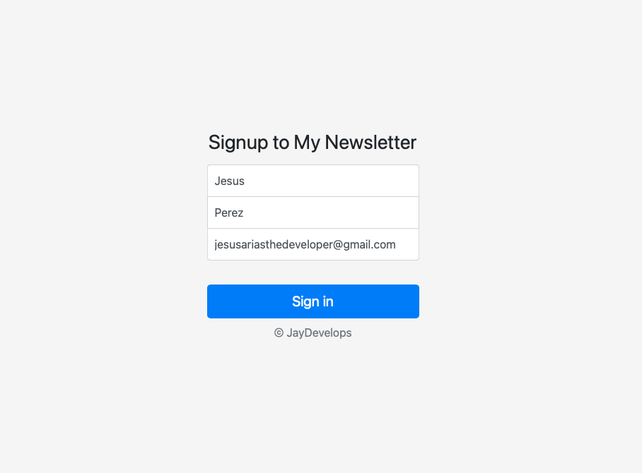

# Simple Newsletter Signup Using MailChimp

## What It Does
This is a simple Node.js app to validate User Input to check if they have
inserted a correct email ending with @ and ending in ".com".
If successful it will redirect the user to a "success" local html file, else 
it will send them to a failure html and ask the user if they like to retry.

### How to Run This Simple Web App
Simply clone this repository to your desktop or download it, open your favorite text editor
and open a new terminal with the folder path then finally run "node app.js". Make sure
to have node.js installed on your computer. Follow the Node.js installion by clicking
[here](https://nodejs.dev/en/learn/how-to-install-nodejs/).

## App Images Below
Below you'll find some images of the applications if you do not want to run the application locally :)

### Starting Page
